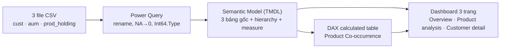
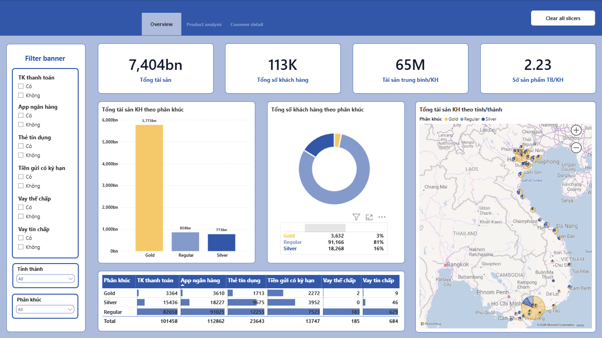

<div align="center">

# Bank Customer Segmentation Dashboard

### Xác định nên bán chéo sản phẩm nào, cho phân khúc nào, để đạt +20% doanh thu quý tới

<p>
  
  
  
</p>

</div>

---

## Project Overview

Xuất phát điểm của project chỉ có 3 file CSV thô trong `Data/` và 1 bản brief đề bài trong `Docs/`. Toàn bộ phần còn lại (semantic model, report, thiết kế màu, README này) đều được xây dựng từ đó.

Bài toán: chi nhánh có 113.066 khách hàng, chia 3 phân khúc (Gold/Silver/Regular) và 6 dòng sản phẩm. Ban giám đốc đặt mục tiêu **+20% doanh thu quý tới** nhưng chưa biết nên tập trung bán chéo sản phẩm nào, cho ai. Dashboard này biến 3 file CSV thành 1 semantic model DAX, trả lời trực tiếp câu hỏi đó qua 3 trang report, không chỉ báo cáo số liệu tổng quan.

Các câu hỏi project trả lời:
- Phân khúc nào đang nắm nhiều tài sản (AUM) nhất, phân khúc nào đông nhất?
- Sản phẩm nào hay được sở hữu cùng nhau (cross-sell)?
- AUM có tương quan với số lượng sản phẩm sinh lãi khách hàng đang giữ không?
- Khách hàng phân bổ ra sao theo tỉnh/thành?

## Table of Contents

- [Project Overview](#project-overview)
- [Project Highlights](#project-highlights)
- [Repository Structure](#repository-structure)
- [Dataset Snapshot](#dataset-snapshot)
- [Data Pipeline](#data-pipeline)
- [Semantic Model](#semantic-model)
- [Dashboard](#dashboard)
- [Key Findings](#key-findings)
- [Tech Stack](#tech-stack)
- [Limitations](#limitations)
- [Future Improvements](#future-improvements)

## Project Highlights

| Area | What this project does |
| --- | --- |
| Data prep | Power Query: chuẩn hoá kiểu dữ liệu, sửa giá trị "NA" trong cột thẻ tín dụng thành 0, đổi tên cột sang tiếng Việt, thêm cột Quốc gia cố định. |
| Semantic model | 3 bảng khách hàng-grain (`cust`, `aum`, `prod_holding`) nối 1-1 qua `Mã KH`, hierarchy địa lý, 6 measure DAX, 6 cột nhãn Có/Không cho slicer. |
| Cross-sell analysis | Bảng tính DAX `Product Co-occurrence`: đếm số khách hàng sở hữu đồng thời từng cặp sản phẩm, dựng thành heatmap. |
| Correlation analysis | Scatter AUM trung bình/KH × số sản phẩm sinh lãi/phí, theo từng tỉnh × phân khúc, kiểm chứng giả thuyết "sản phẩm sinh lãi kéo theo tài sản". |
| Dashboard | 3 trang Power BI (PBIR/PBIP), theme màu tự thiết kế theo Slate + Navy, header điều hướng, sidebar slicer cho từng trang. |

## Repository Structure

```text
Bank Customer Segmentation/
|-- Data/                                           # có sẵn từ đầu
|   |-- cust.csv
|   |-- aum.csv
|   `-- prod_holding.csv
|-- Docs/                                           # có sẵn từ đầu (brief đề bài, data dictionary)
|-- PowerBI/                                        # xây trong quá trình làm
|   |-- Bank Customer Segmentation.SemanticModel/   # TMDL: bảng, measure, calculated table
|   |-- Bank Customer Segmentation.Report/          # PBIR: 3 trang report
|   `-- Bank Customer Segmentation.pbip
|-- Design/                                         # xây trong quá trình làm
|   `-- dashboard-design.md                         # Color palette, layout, typography spec
|-- screenshots/                                    # xây trong quá trình làm
`-- Report/                                         # xây trong quá trình làm (báo cáo insight docx/pdf)
```

## Dataset Snapshot

3 bảng gốc, đều 113.066 dòng, nối nhau qua `customer_id`:

| File | Cột gốc | Ghi chú |
| --- | --- | --- |
| `cust.csv` | `customer_id`, `segment`, `province_city` | Phân khúc (Gold/Silver/Regular), 41 tỉnh/thành + nhóm "No Info" |
| `aum.csv` | `customer_id`, `amount` | Tổng tài sản (AUM) của khách hàng |
| `prod_holding.csv` | `customer_id`, `prod_ca`, `prod_td`, `prod_credit_card`, `prod_app`, `prod_secured_loan`, `prod_upl` | 6 cột cờ 0/1, tương ứng TK thanh toán, Tiền gửi có kỳ hạn, Thẻ tín dụng, App ngân hàng, Vay thế chấp, Vay tín chấp |

Vấn đề chất lượng dữ liệu phát hiện được: cột `prod_credit_card` chứa giá trị chuỗi "NA" thay vì số, phải xử lý bằng `Table.ReplaceValue` trước khi convert kiểu `Int64.Type`, nếu không refresh sẽ lỗi kiểu dữ liệu.

## Data Pipeline



## Semantic Model

Đây không phải star schema fact/dimension truyền thống. Mô hình thực tế là 3 bảng cùng grain khách hàng (`Mã KH` là khoá), nối quan hệ 1-1:

- `cust`: Mã KH, Phân khúc, Tỉnh thành, Quốc gia, hierarchy Địa lý
- `aum`: Mã KH, Tổng tài sản
- `prod_holding`: Mã KH + 6 cột cờ sản phẩm (0/1) + 6 cột nhãn Có/Không cho slicer

Từ `prod_holding`, DAX dựng thêm bảng tính `Product Co-occurrence` (Product A × Product B, số lượng đồng sở hữu) phục vụ heatmap cross-sell ở trang Product analysis.

6 measure chính: `Tổng số khách hàng`, `% Tổng khách hàng`, `Tổng tài sản (AUM)`, `AUM trung bình/KH`, `Số sản phẩm TB/KH`, `Số SP sinh lãi/phí TB/KH` (loại trừ TK thanh toán và App ngân hàng, 2 sản phẩm nền tảng không trực tiếp sinh doanh thu).

## Dashboard

**Overview**: 4 KPI card, AUM theo phân khúc, donut khách hàng, bản đồ AUM theo tỉnh/thành, bảng pivot sản phẩm, 8 slicer


**Product analysis**: scatter AUM × số sản phẩm sinh lãi, heatmap cross-sell, 6 slicer sản phẩm


**Customer detail**: bảng chi tiết khách hàng (drill-through), 7 slicer


## Key Findings

> **AUM (Assets Under Management)** = tổng tài sản khách hàng đang nắm giữ tại ngân hàng (đo bằng measure `Tổng tài sản (AUM)`, cộng dồn từ `aum.csv`).
>
> **Độ sâu sản phẩm** = số sản phẩm trung bình mà 1 khách hàng đang sở hữu cùng lúc (đo bằng measure `Số SP sinh lãi/phí TB/KH`, tính trên 4 sản phẩm sinh lãi: Tiền gửi có kỳ hạn, Thẻ tín dụng, Vay thế chấp, Vay tín chấp). Ví dụ độ sâu = 0,23 nghĩa là trung bình cứ 100 khách hàng thì mới có 23 sản phẩm sinh lãi được sở hữu, tức phần lớn khách trong nhóm đó chưa có sản phẩm sinh lãi nào cả.

**Số liệu quan sát được:**
- Lệch pha nghiêm trọng giữa số lượng và giá trị: Regular chiếm **80,6%** khách hàng nhưng chỉ nắm **858 tỷ** AUM (~**12%**); Gold chỉ **3,2%** khách hàng lại nắm **78%** tổng AUM.
- Độ sâu sản phẩm chênh gần **5 lần** theo phân khúc: Gold trung bình **1,10** sản phẩm sinh lãi/phí, Regular chỉ **0,23**.
- AUM tương quan dương với độ sâu sản phẩm trên scatter chart: khách càng giữ nhiều sản phẩm sinh lãi, AUM càng cao.
- Silver là nhóm trung gian: AUM còn thấp ngang Regular nhưng độ sâu sản phẩm đã gần bằng Gold.
- Trong 6 cặp có thể tạo ra từ 4 sản phẩm sinh lãi, cặp Tiền gửi có kỳ hạn + Thẻ tín dụng có **3.102** khách hàng sở hữu cả 2, cao vượt trội so với 5 cặp còn lại (chỉ **13** đến **185** khách).
- Hà Nội và TP.HCM chiếm **65%** tổng số khách hàng Regular (**32.815** + **26.524** trên **91.166** khách). Riêng Đồng Nai có độ sâu sản phẩm chỉ **0,06**, thấp nhất trong các tỉnh đông khách, dù lượng khách không nhỏ (**1.460** người).

**Hướng giải quyết bài toán +20% doanh thu:**
1. Ưu tiên Regular làm target chính cho chiến dịch cross-sell: nhóm volume lớn nhất và độ sâu sản phẩm thấp nhất, nên biên độ tăng trưởng khi dịch chuyển cũng lớn nhất.
2. Chọn Thẻ tín dụng làm sản phẩm mở đầu cho khách đã có Tiền gửi có kỳ hạn (và ngược lại): đây là combo phổ biến nhất theo ma trận Cross-sell, tỷ lệ chấp nhận dự kiến cao hơn so với chào sản phẩm ngẫu nhiên.
3. Với Silver, ưu tiên upsell tăng AUM (sản phẩm tiết kiệm/đầu tư giá trị cao) thay vì thêm sản phẩm mới: đòn bẩy hiệu quả hơn nằm ở tăng tài sản, không phải tăng số lượng sản phẩm.
4. Ưu tiên Hà Nội và TP.HCM trước khi dàn trải toàn quốc: cùng một nguồn lực campaign, tập trung vào 2 địa bàn này tạo tác động lớn hơn nhiều so với chia đều cho 41 tỉnh/thành. Đồng Nai là địa bàn phụ đáng thử nghiệm cross-sell riêng.

## Tech Stack

**Power BI Desktop** (Power Query M + DAX), không dùng thêm công cụ nào khác. Toàn bộ data prep, model quan hệ, và phân tích cross-sell/tương quan xử lý gọn trong DAX, không cần pipeline ETL hay database ngoài.

## Limitations

- Dữ liệu là 1 snapshot tại 1 thời điểm, không có chiều thời gian, chưa phân tích được xu hướng theo tháng/quý.
- Toạ độ tỉnh/thành trên bản đồ là toạ độ trung tâm tỉnh (geocode gần đúng qua tên), không phải vị trí chi nhánh thật.
- Một số dòng có Tỉnh thành = "No Info" (không xác định), không hiển thị trên bản đồ.
- Model không có bảng ngày (date table) nên không hỗ trợ time intelligence.

## Future Improvements

- Bổ sung dữ liệu giao dịch theo thời gian để phân tích xu hướng và dự báo doanh thu.
- Thêm drillthrough từ trang Overview sang Customer detail theo đúng khách hàng được click.
- Tự động hoá refresh nếu triển khai lên Power BI Service (hiện đang refresh thủ công từ CSV local).
