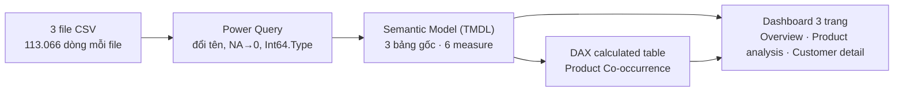
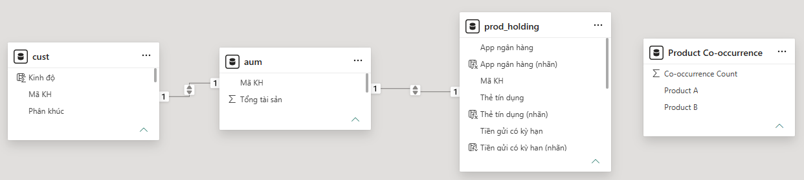
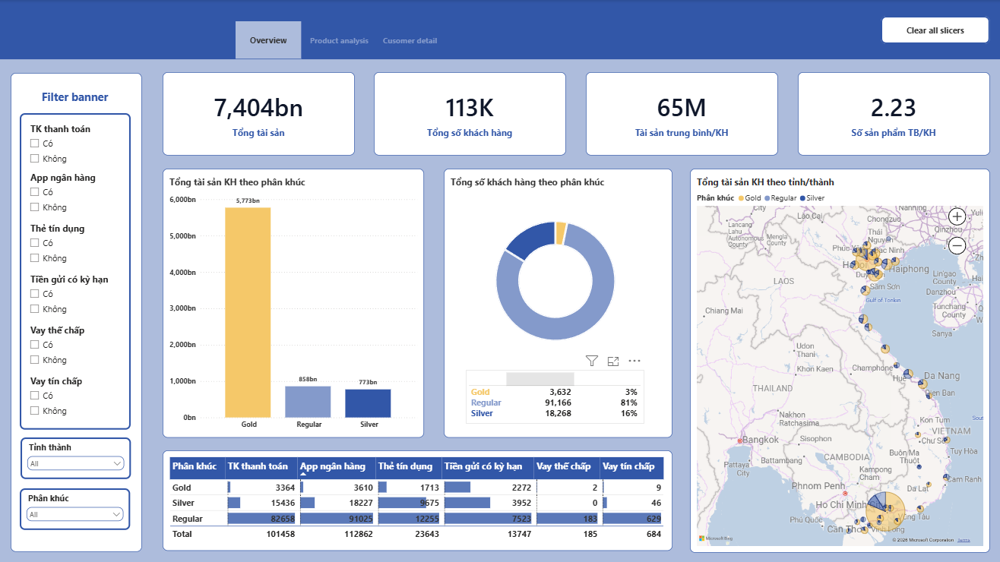

<div align="center">

# Bank Customer Segmentation Dashboard

### Xác định nên bán chéo sản phẩm nào, cho phân khúc nào, để đạt +20% doanh thu quý tới

<p>
  
  
  
</p>

</div>

---

## Project Overview

Xuất phát điểm của project chỉ có 3 file CSV thô trong `Data/` và 1 bản brief đề bài trong `Docs/`. Toàn bộ phần còn lại (semantic model, report, thiết kế màu, README này) được xây dựng từ đó.

Đề bài yêu cầu một báo cáo cho giám đốc chi nhánh với mục tiêu tăng 20% doanh thu quý tới. Chi nhánh có 113.066 khách hàng, chia 3 phân khúc (Gold, Silver, Regular) và 6 dòng sản phẩm. Dashboard biến 3 file CSV thành một semantic model DAX và trả lời câu hỏi nên bán chéo sản phẩm nào, cho phân khúc nào, qua 3 trang report.

Các câu hỏi project trả lời:
- Phân khúc nào đang nắm nhiều tài sản (AUM) nhất, phân khúc nào đông khách nhất? _(giám đốc chi nhánh)_
- Sản phẩm nào hay được sở hữu cùng nhau? _(đội bán chéo)_
- AUM có tương quan với số sản phẩm sinh lãi khách hàng đang giữ không? _(giám đốc chi nhánh)_
- Khách hàng phân bổ ra sao theo tỉnh/thành? _(đội vận hành chi nhánh)_

## Table of Contents

- [Project Overview](#project-overview)
- [Project Highlights](#project-highlights)
- [Repository Structure](#repository-structure)
- [Raw Data](#raw-data)
- [Data Pipeline](#data-pipeline)
- [Semantic Model](#semantic-model)
- [Dashboard](#dashboard)
- [Key Findings](#key-findings)
- [Tech Stack](#tech-stack)

## Project Highlights

| Area | What this project does |
| --- | --- |
| Data prep | Power Query: chuẩn hoá kiểu dữ liệu, thay "NA" thành 0 ở cột thẻ tín dụng, đổi tên cột sang tiếng Việt. |
| Semantic model | 3 bảng cùng grain khách hàng nối 1-1 qua `Mã KH`, hierarchy địa lý, 6 measure DAX, 6 cột nhãn Có/Không cho slicer. |
| Cross-sell analysis | Bảng tính DAX `Product Co-occurrence` đếm số khách hàng sở hữu đồng thời từng cặp sản phẩm, hiển thị dạng heatmap. |
| Correlation analysis | Scatter AUM trung bình/KH × số sản phẩm sinh lãi theo từng tỉnh × phân khúc, kiểm tra xem tài sản có đi cùng độ sâu sản phẩm không. |
| Dashboard | 3 trang Power BI, theme màu tự thiết kế (Navy, Gold, Regular tint), header điều hướng, sidebar slicer riêng cho từng trang. |

## Repository Structure

```text
Bank Customer Segmentation/
|-- Data/                                           # có sẵn từ đầu
|   |-- cust.csv
|   |-- aum.csv
|   `-- prod_holding.csv
|-- Docs/                                           # có sẵn từ đầu (brief đề bài, data dictionary)
|-- PowerBI/                                        # xây trong quá trình làm
|   |-- Bank Customer Segmentation.SemanticModel/   # TMDL: bảng, measure, calculated table
|   |-- Bank Customer Segmentation.Report/          # PBIR: 3 trang report
|   `-- Bank Customer Segmentation.pbip
|-- Design/                                         # xây trong quá trình làm
|   `-- dashboard-design.md                         # Color palette, layout, typography spec
|-- Img/                                            # xây trong quá trình làm (ảnh chụp dashboard, sơ đồ model)
`-- Report/                                         # xây trong quá trình làm (báo cáo insight docx/pdf)
```

## Raw Data

Dữ liệu gốc gồm 3 file CSV trong `Data/`, được commit lên Git cùng project.

| File | Số dòng |
| --- | ---: |
| `cust.csv` | 113.066 |
| `aum.csv` | 113.066 |
| `prod_holding.csv` | 113.066 |
| **Tổng** | **339.198** |

Các cột có ý nghĩa:
- `customer_id`: mã khách hàng, khoá nối 3 file
- `segment`: phân khúc (Gold, Silver, Regular)
- `province_city`: tỉnh/thành, gồm 41 giá trị và nhóm "No Info"
- `amount`: tổng tài sản (AUM) của khách hàng
- `prod_ca`: TK thanh toán (cờ 0/1)
- `prod_td`: Tiền gửi có kỳ hạn (cờ 0/1)
- `prod_credit_card`: Thẻ tín dụng (cờ 0/1)
- `prod_app`: App ngân hàng (cờ 0/1)
- `prod_secured_loan`: Vay thế chấp (cờ 0/1)
- `prod_upl`: Vay tín chấp (cờ 0/1)

**Xử lý dữ liệu chính trong Power Query:**
- Đổi tên cột sang tiếng Việt (`customer_id` → `Mã KH`, `segment` → `Phân khúc`, `province_city` → `Tỉnh thành`, `amount` → `Tổng tài sản`).
- Thêm cột `Quốc gia` với giá trị cố định "Việt Nam" để làm gốc cho hierarchy địa lý.
- Thay chuỗi "NA" thành 0 ở cột `prod_credit_card` bằng `Table.ReplaceValue`, trước khi chuyển sang kiểu `Int64.Type`. Nếu bỏ bước này, refresh sẽ lỗi kiểu dữ liệu.

Caveat dữ liệu: file không có cột ngày, nên đây là snapshot tại một thời điểm và không phân tích được xu hướng theo tháng hoặc quý. Nhóm "No Info" trong `province_city` không xác định được tỉnh nên không hiển thị trên bản đồ.

## Data Pipeline


```mermaid
flowchart LR
    A["3 file CSV<br/>113.066 dòng mỗi file"] --> B["Power Query<br/>đổi tên, NA→0, Int64.Type"]
    B --> C["Semantic Model (TMDL)<br/>3 bảng gốc · 6 measure"]
    C --> D["DAX calculated table<br/>Product Co-occurrence"]
    C --> E["Dashboard 3 trang<br/>Overview · Product analysis · Customer detail"]
    D --> E
```

## Semantic Model



Mô hình gồm 3 bảng cùng grain khách hàng, nối quan hệ 1-1 qua `Mã KH`, không phải star schema fact/dimension:

- `cust`: 1 dòng mỗi khách hàng, gồm Mã KH, Phân khúc, Tỉnh thành, Quốc gia và hierarchy Địa lý (Quốc gia > Tỉnh thành)
- `aum`: 1 dòng mỗi khách hàng, gồm Mã KH và Tổng tài sản
- `prod_holding`: 1 dòng mỗi khách hàng, gồm Mã KH, 6 cột cờ sản phẩm (0/1) và 6 cột nhãn Có/Không dùng cho slicer

Model không có bảng ngày (date table), nên chưa hỗ trợ time intelligence. Lý do là dữ liệu chỉ có một snapshot.

Có 6 measure, tất cả đều đang hiển thị trên dashboard. Ngoài ra có 1 bảng tính DAX `Product Co-occurrence` dựng từ `prod_holding`.

**Các measure phức tạp nhất:**
- `% Tổng khách hàng`: `DIVIDE` số khách của phân khúc với `CALCULATE` tổng khách bỏ lọc phân khúc bằng `ALL`, cho tỷ trọng mỗi phân khúc.
- `Số SP sinh lãi/phí TB/KH`: `AVERAGEX` trên từng khách hàng, cộng 4 cờ sản phẩm sinh lãi, rồi lấy trung bình. Loại trừ TK thanh toán và App ngân hàng vì 2 sản phẩm này không trực tiếp sinh doanh thu.
- `Product Co-occurrence`: bảng tính dùng `UNION` và `ROW` để tạo từng cặp sản phẩm, với số khách hàng sở hữu đồng thời cả hai.

## Dashboard

**1. Overview**: 4 KPI card, cột AUM theo phân khúc, donut số khách hàng, bản đồ AUM theo tỉnh/thành (định vị bằng tên tỉnh, nên toạ độ là gần đúng), bảng pivot sản phẩm và 8 slicer.


**2. Product analysis**: scatter AUM trung bình/KH × số sản phẩm sinh lãi (mỗi điểm là một tỉnh × phân khúc), heatmap cross-sell từ bảng `Product Co-occurrence`, và 6 slicer sản phẩm.


**3. Customer detail**: bảng chi tiết từng khách hàng (drill-through), kèm tổng AUM và số sản phẩm trung bình, và 7 slicer.


## Key Findings

> **AUM (Assets Under Management)** = tổng tài sản khách hàng đang nắm giữ tại ngân hàng, cộng dồn từ `aum.csv`.
>
> **Độ sâu sản phẩm** = số sản phẩm trung bình mà 1 khách hàng đang sở hữu cùng lúc, tính trên 4 sản phẩm sinh lãi (Tiền gửi có kỳ hạn, Thẻ tín dụng, Vay thế chấp, Vay tín chấp). Độ sâu 0,23 nghĩa là trung bình cứ 100 khách hàng mới có 23 sản phẩm sinh lãi, tức phần lớn khách chưa có sản phẩm sinh lãi nào.

**Số liệu quan sát được:**
- Regular chiếm **80,6%** khách hàng nhưng chỉ nắm **858 tỷ** AUM (khoảng **12%** tổng), trong khi Gold chỉ **3,2%** khách hàng nhưng nắm **78%** tổng AUM.
- Độ sâu sản phẩm Gold là **1,10**, Silver là **0,75** và Regular chỉ **0,23**, tức Gold gấp gần **5 lần** Regular.
- AUM tương quan dương với độ sâu sản phẩm trên scatter chart: khách giữ nhiều sản phẩm sinh lãi có AUM cao hơn.
- Trong 6 cặp tạo ra từ 4 sản phẩm sinh lãi, cặp Tiền gửi có kỳ hạn + Thẻ tín dụng có **3.102** khách sở hữu cả hai, cao hơn hẳn 5 cặp còn lại (từ **13** đến **185** khách).
- Hà Nội và TP.HCM chiếm **65%** khách hàng Regular (**32.815** + **26.524** trên **91.166** khách). Đồng Nai có độ sâu sản phẩm chỉ **0,06**, thấp nhất trong các tỉnh đông khách, dù có **1.460** khách.

**Đề xuất hành động:**
1. Ưu tiên Regular làm target chính cho chiến dịch cross-sell: nhóm này chiếm **80,6%** khách hàng nhưng độ sâu chỉ **0,23**, nên dư địa tăng là lớn nhất.
2. Chào Thẻ tín dụng cho khách đã có Tiền gửi có kỳ hạn, và ngược lại: cặp này có **3.102** khách sở hữu cả hai, cao nhất trong 6 cặp.
3. Với Silver, ưu tiên upsell tăng AUM thay vì thêm sản phẩm: nhóm này có độ sâu **0,75**, đã cao gấp **3** lần Regular, nên thêm sản phẩm không còn là điểm nghẽn bằng tài sản.
4. Ưu tiên Hà Nội và TP.HCM trước khi dàn trải toàn quốc: 2 thành phố chiếm **65%** khách Regular, nên cùng một nguồn lực thì tập trung vào đây tạo tác động lớn hơn. Đồng Nai là địa bàn phụ nên thử cross-sell riêng vì độ sâu chỉ **0,06**.

## Tech Stack

- **Power BI Desktop**: xây semantic model, 3 trang report và toàn bộ slicer, bản đồ.
- **Power Query (M)**: đổi tên cột, thay "NA" thành 0, chuyển kiểu dữ liệu cho 3 bảng gốc.
- **DAX**: 6 measure và bảng tính `Product Co-occurrence`.
- **Git / GitHub**: quản lý phiên bản repo và đẩy lên GitHub.
